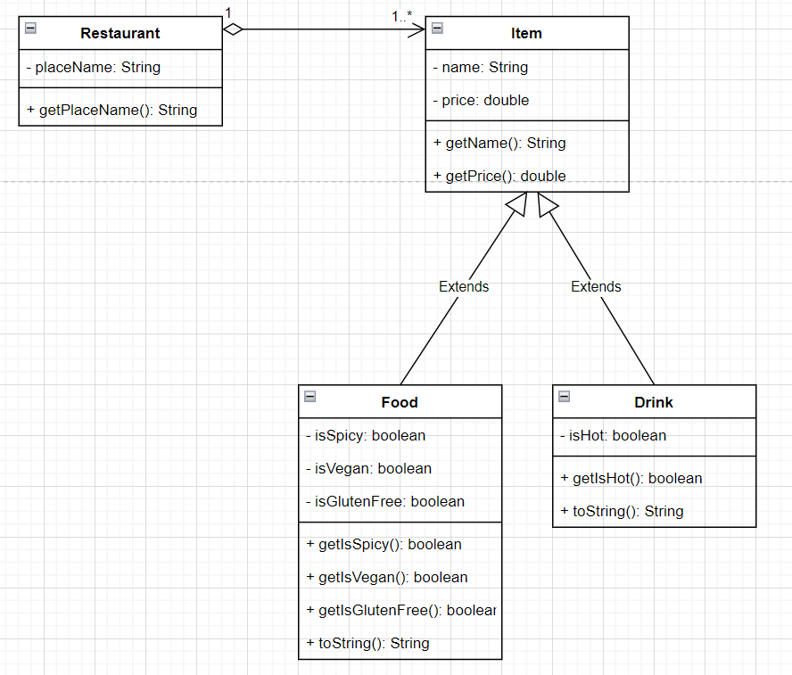

# ICS4U OOP Assignment

## Summary
This program simulates the functionality of an online food ordering system. It uses 4 classes alongside the Main class to do so. The Restaurant class holds the name of the restaurant and __has a__ relationship with Item.java that stores the price and name of a menu item. Food.java and Drink.java both __extend__ the usage from Item.java and additionally have their own methods and instance variables that are unique to drinks and food items. When the program is ran it will begin by initializing the objects in the menu. Then it will go through a while loop where it continuously output the menu options with all of their properties (eg. spiciness, price). The user can input a choice (0-13) to add to cart, (99) to move to the checkout stage, or (100) to exit the program. Once in the checkout stage it will output the user's cart using an arraylist and calculate the total, tax, subtotal, and any applicable discounts.

## Instructions
In order to run the program properly you will need to use the terminal in order to input decisions. Essentially you follow the instructions outputted by the program and keep adding items into your cart via inputting an integer when asked. Then when content you input "99" in order to proceed to the checkout where the total will be computed.
